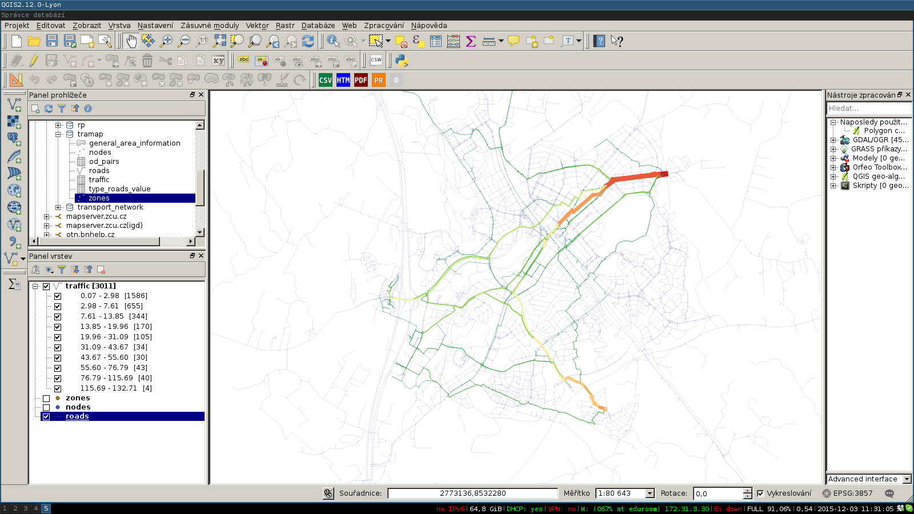

<h1>Transpotation modelling</h1>
<h2>Tutorial</h2>

This tutorial is for Debian based distribution (Debian, Ubuntu, Mint, Lubuntu, ...)

<h3>What you need?</h3>

<li>PostgeSQL database with <a href="http://postgis.net/">PostGIS extension</a></li>
<li> <a href="http://www.qgis.org">QGIS</a></li>

Download folder <a href="https://github.com/PapyPev/TraMap/tree/master/srv">srv/</a>.

<h3>Database</h3>

	Create example database:
	 <code>cd $ROOT/srv/data/example</code>
	 <code>psql -d $DBNAME -f db_schema.sql</code>
	 <code>psql -d $DBNAME -f tramap_backup.sql</code>

	Now you can inspect example data in QGIS. You should see roads, nodes and zones.
	

	We have database with example data. Now we have to configure <code>srv/src/transp_model/db_settings.py.templete.py</code>. In this file you must set information about database like username, password, port, ... and rename to <code>db_settings.py</code>

	Now we can compute traffic based on example dataset.
	<pre>
kolovsky@thinkpad:~/..../TraMap/srv/src$ ipython
Python 2.7.9 (default, Mar  1 2015, 12:57:24) 
Type "copyright", "credits" or "license" for more information.

IPython 2.3.0 -- An enhanced Interactive Python.
?         -> Introduction and overview of IPython's features.
%quickref -> Quick reference.
help      -> Python's own help system.
object?   -> Details about 'object', use 'object??' for extra details.

In [1]: import transp_model

In [2]: model = transp_model.tm.TransModel()

In [3]: model.trip_destination(0.01, 30)
100%...Done!
Out[3]: (0.0096536274755067986, 0.0015216649946937478)

In [4]: model.count_transport()
100%...Done!  

In [5]: model.save_traffic()

In [6]:
	</pre>
	Go to back to QGIS and in DBManger execute this query
	 <code>SELECT r.geometry, t.* FROM tramap.traffic as t, tramap.roads as r WHERE t.road_id = r.id;</code>
	and load result to map.

	

<h2>What's next?</h2>

	More details about matematical mode you can find in project <a href="../report/main.pdf">report</a>. More information about database is<a href="DOC02-Database.md">here</a>.

<h3>Settings for Transpotation modelnig</h3>

Settings file for transpotation modeling is located <code>srv/src/transp_model/tm_settings.py</code>. This file contains a lot of comments, so I hope that every person understand it.

<b> NOTE! This project was focused to modeling for bike, so seetings is for it. You can use liblary for another type (car,..), but you must be careful.

