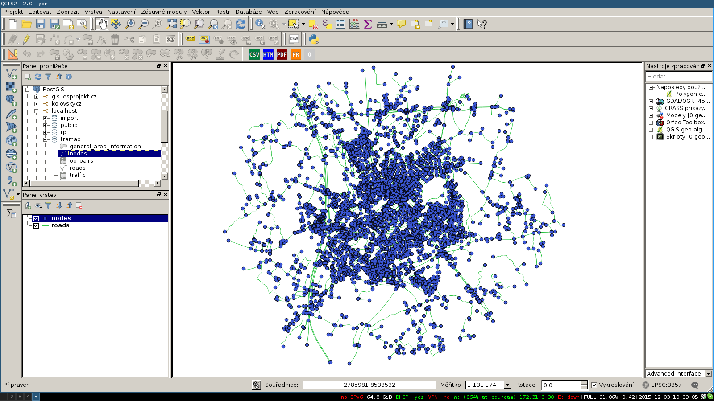

<h1>Transpotation modelling</h1>
<h2>Tutorial</h2>

This tutorial is for Debian based distribution (Debian, Ubuntu, Mint, Lubuntu, ...)

<h3>What you need?</h3>

<li>PostgeSQL database with <a href="http://postgis.net/">PostGIS extension</a></li>
<li><a href="http://www.qgis.org">QGIS</a></li>

Download folder <a href="https://github.com/PapyPev/TraMap/tree/master/srv">srv/</a>.

<h3>Database</h3>

	Create example database:
	 <code>cd $ROOT/srv/data/example</code>
	 <code>psql -d $DBNAME -f db_schema.sql</code>
	 <code>psql -d $DBNAME -f tramap_backup.sql</code>

	Now you can inspect example data in QGIS. You should see roads, nodes and zones.
	

	We have database with example data. Now we have to configure <code>srv/src/transp_model/db_settings.py.templete.py</code>. In this file you must set information about database like username, password, port, ... and rename to <code>db_settings.py</code>

	<code>SELECT r.geometry, t.* FROM tramap.traffic as t, tramap.roads as r WHERE t.road_id = r.id;</code>

